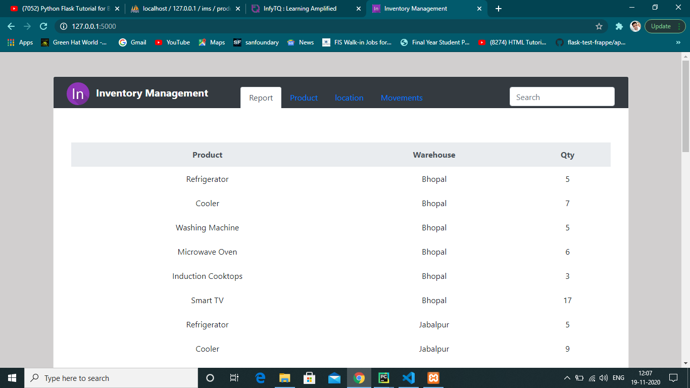
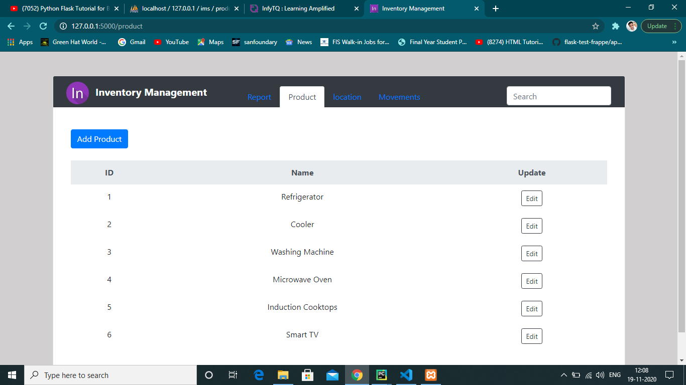
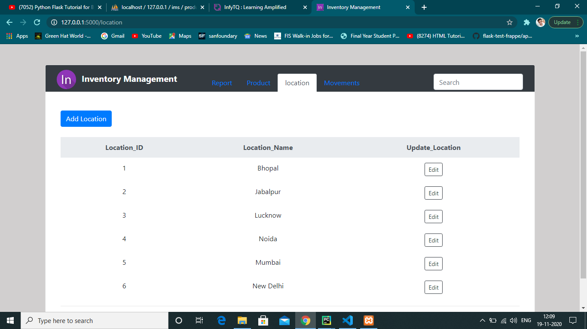
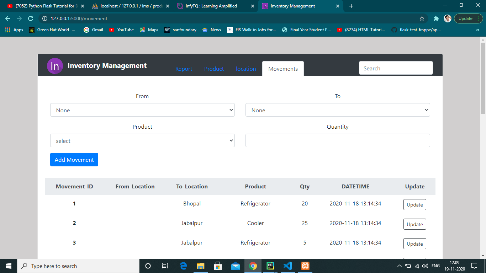
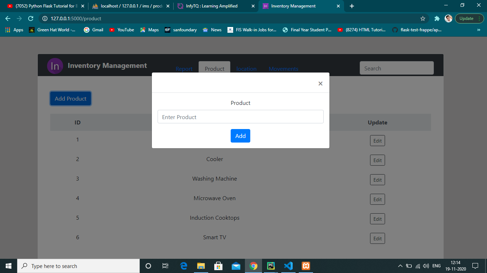
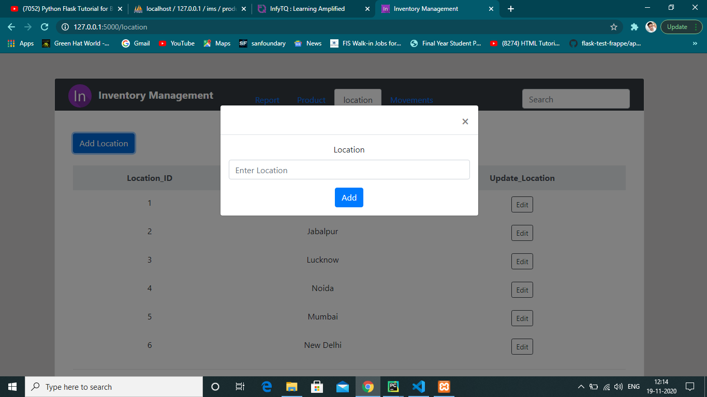
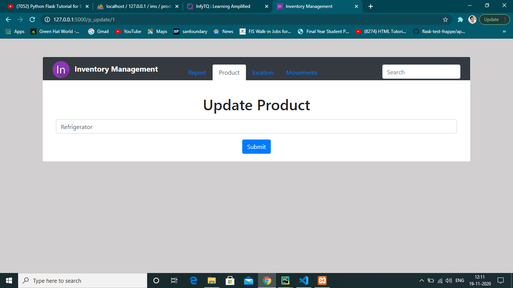
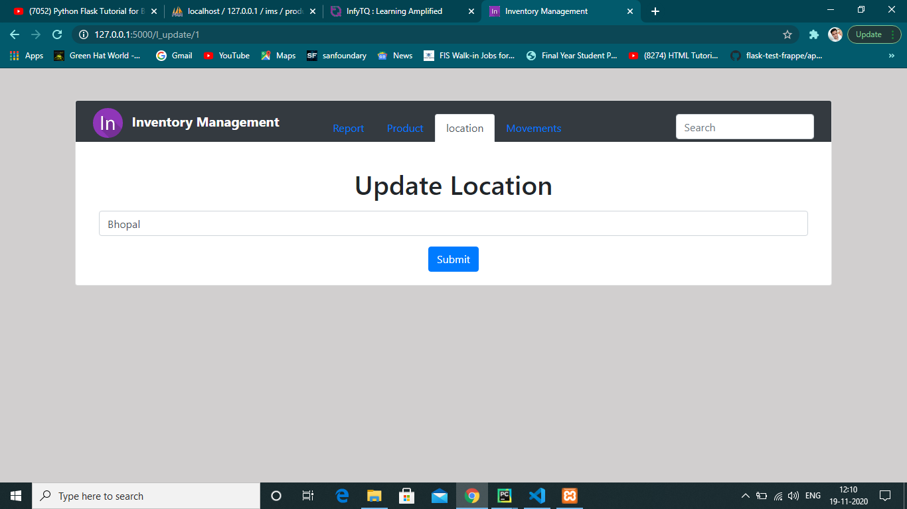
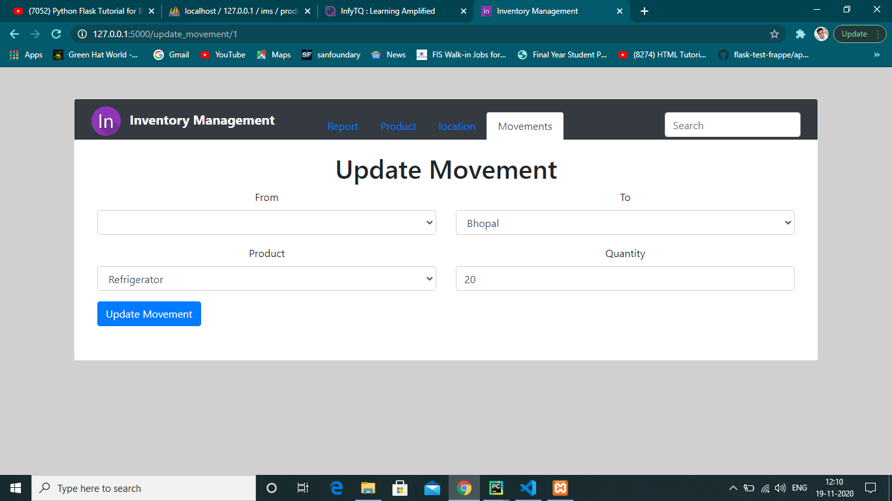

# Inventory-Management-App
Frappe Flask Inventory Management App

Below are the screenshots of this web Application

## Report

## Product

## Location

## Movements

## Add Products

## Add Location

## Edit Products

## Edit Location

## Update Movements

